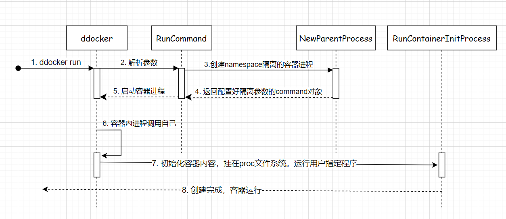
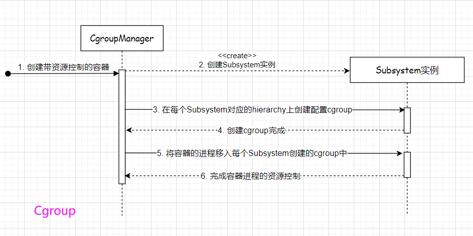
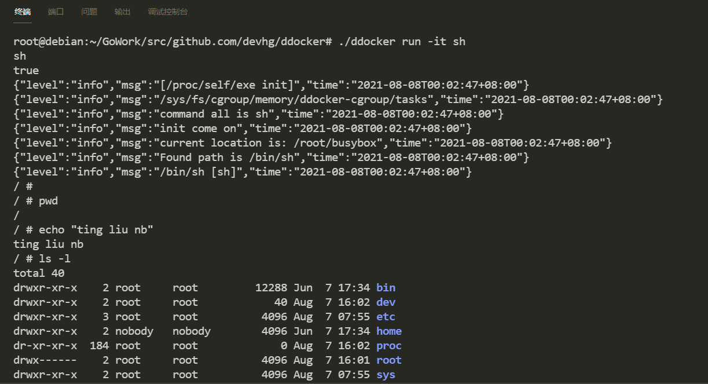

# ddocker

<<自己动手写docker>>

> Doc: <https://www.yuque.com/playgo/ddocker>

## call flow



## cgroup resource control



## create container with pipe


## run command

```bash
root@ubuntu1404:~/GoWork/src/github.com/devhg/ddocker# go build .

root@ubuntu1404:~/GoWork/src/github.com/devhg/ddocker# ./ddocker run -it -mm 100m stress --vm-bytes 200m --vm-keep -m 1

root@ubuntu1404:~/GoWork/src/github.com/devhg/ddocker# ./ddocker run -it -mm 100m -cpushare 512 stress --vm-bytes 200m --vm-keep -m 1

root@ubuntu1404:~/GoWork/src/github.com/devhg/ddocker# ./ddocker run -it ls -l

root@ubuntu1404:~/GoWork/src/github.com/devhg/ddocker# ./ddocker run -it bash
```

## Preview

create a busybox container


## Q & A

[Q&A](./problems.md)
