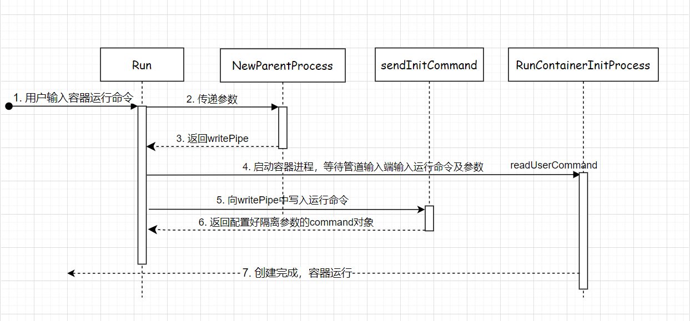
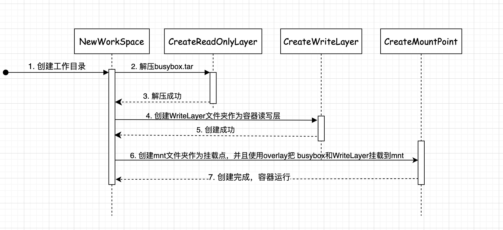
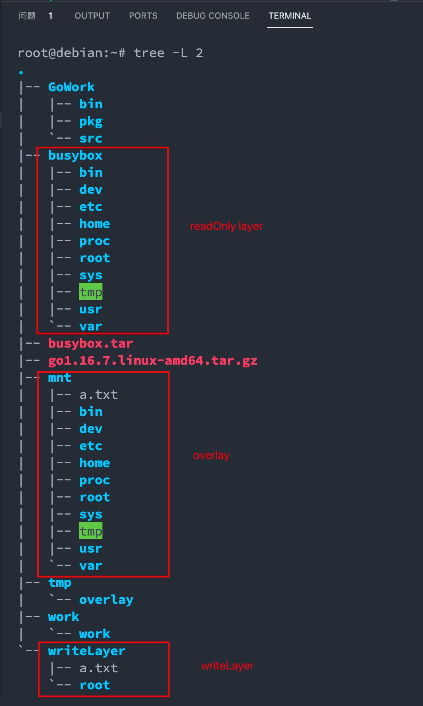

# ddocker

<<自己动手写docker>>

> Doc: <https://www.yuque.com/playgo/ddocker>

## call flow


## cgroup resource control


## create container with pipe



## support overlay



## run command

```bash
root@ubuntu1404:~/GoWork/src/github.com/devhg/ddocker# go build .

root@ubuntu1404:~/GoWork/src/github.com/devhg/ddocker# ./ddocker run -it -mm 100m stress --vm-bytes 200m --vm-keep -m 1

root@ubuntu1404:~/GoWork/src/github.com/devhg/ddocker# ./ddocker run -it -mm 100m -cpushare 512 stress --vm-bytes 200m --vm-keep -m 1

root@ubuntu1404:~/GoWork/src/github.com/devhg/ddocker# ./ddocker run -it ls -l

root@ubuntu1404:~/GoWork/src/github.com/devhg/ddocker# ./ddocker run -it bash

root@debian:~/GoWork/src/github.com/devhg/ddocker# ./ddocker run -it -v /root/volume:/container sh
sh
```

## Preview

create a busybox container



overlay data volumes
https://www.yuque.com/docs/share/355c28d6-ac77-4764-82b7-5d75ea71600a?# 《5. 支持宿主机和容器volume宗卷映射》

## 遇到的问题总结

[Q&A](./problems.md)
